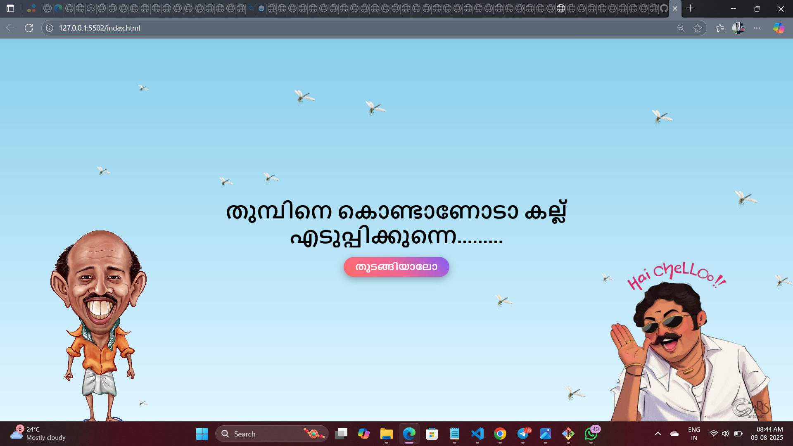
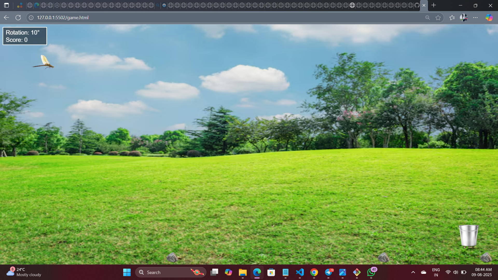

# [Project Name] 🎯
THUMBINEY KONDANO KALLEDUPPIKKUNNEY

## Basic Details
### Team Name: [SLEEPER BUILD!!!]

### Team Members
- Team Lead: [Muhammed Anshif] - [EMEA COLLEGE]
- Member 2: [Muhammed Fadil] - [EMEA COLLEGE]

### Project Description
[A FUN AND INTERACTIVE GAME 'THUMBINEY KONDANO KALLEDUPPIKKUNNEY". The scene opens with a Malayalam. actor's dialogue and the heading:
A  "Is Thumbi picking up stones?"
As Thumbi picks up a stone, the camera captures the action from a special angle. Thumbi carefully places each stone into a bucket.
Once all the stones are in the bucket, the frog swiftly catches Thumbi.]

## Technical Details
### Technologies/Components Used
For Software:
- [HTML ,CSS,JS]
- [VS CODE]

# Screenshots (Add at least 3)

*Add caption explaining what this shows*

*Add caption explaining what this shows*

## Team Contributions
- [Fadil]: [idea+home page]
- [Name 2]: [idea+home page]
- 

---
Made with ❤️ at TinkerHub Useless Projects 

